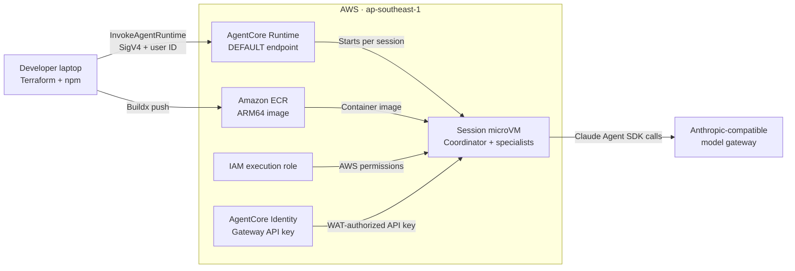

# Lab10 — Deploy to AgentCore Runtime with Terraform

Lab09 packaged the coordinator as an AgentCore-compatible container. This lab provisions the AWS resources needed to run that image: Amazon ECR, an AgentCore Identity API key credential provider, an IAM execution role, and AgentCore Runtime.

The deployed container does not receive the gateway API key as an environment variable. AgentCore Runtime supplies a workload access token for each request, and the application exchanges that token for the API key stored by AgentCore Identity. Only the gateway URL, model name, Region, and credential-provider name are passed as runtime environment variables.

## What you will build



The request remains `{ "prompt": "..." }`. The response is an SSE stream containing trace events and one final event.

## Prerequisites

- Node.js 22 or later and npm 10 or later
- Docker with Buildx
- AWS CLI v2 configured with credentials
- Terraform 1.11 or later
- Access to AgentCore Runtime and Identity in `ap-southeast-1`
- An API key and model name accepted by your Anthropic-compatible gateway

Your AWS principal must be allowed to manage ECR, IAM roles and policies, AgentCore Runtime, AgentCore Identity credential providers, and the required AgentCore service-linked role. It also needs `iam:PassRole` for the runtime execution role.

## 1. Configure the shared environment

From the repository root:

```bash
cp .env.example .env
```

Set these values in `.env`:

```dotenv
ANTHROPIC_API_KEY=replace-with-your-gateway-key
ANTHROPIC_BASE_URL=https://your-anthropic-compatible-gateway.example
CLAUDE_MODEL=your-gateway-model-id
AWS_REGION=ap-southeast-1
AGENT_RUNTIME_USER_ID=lab10-demo-user
```

Install the lab dependencies:

```bash
cd Lab10
npm ci
```

## 2. Test locally

Start the runtime-compatible server:

```bash
LAB10_PORT=18080 npm run server
```

In another terminal:

```bash
cd Lab10
LAB10_PORT=18080 npm run demo:local -- \
  "Investigate cases/case-001.md using both specialists."
```

The local path uses `ANTHROPIC_API_KEY` directly because there is no AgentCore workload identity outside AWS.

You can also exercise the ARM64 image with Docker Compose:

```bash
docker compose up --build
```

Then run the same `demo:local` command with `LAB10_PORT=18080`. Compose is only for local container testing; Terraform and ECR deploy the image to AWS.

## 3. Load deployment variables

Run these commands from `Lab10`. They load the root `.env` without copying its values into Terraform files:

```bash
set -a
source ../.env
set +a

export AWS_REGION="${AWS_REGION:-ap-southeast-1}"
export TF_VAR_aws_region="$AWS_REGION"
export TF_VAR_gateway_api_key="$ANTHROPIC_API_KEY"
export TF_VAR_anthropic_base_url="$ANTHROPIC_BASE_URL"
export TF_VAR_claude_model="$CLAUDE_MODEL"
```

`TF_VAR_gateway_api_key` is consumed by Terraform's write-only `api_key_wo` argument. Terraform sends it to AgentCore Identity without storing it in state. Increment `gateway_api_key_version` when you rotate the key.

## 4. Apply the bootstrap stage

The first stage creates the immutable, scan-on-push ECR repository and the AgentCore Identity API key credential provider:

```bash
terraform -chdir=infra/bootstrap init
terraform -chdir=infra/bootstrap apply
```

Review the plan before approving it. The local state in `infra/bootstrap/terraform.tfstate` is read by the runtime stage and is ignored by Git.

## 5. Build and push the ARM64 image

The default immutable image tag is `v1`:

```bash
npm run image:push -- v1
```

The script reads the ECR URL and Region from the bootstrap outputs, signs Docker in to ECR, and uses Buildx to build and push `linux/arm64`. Because tags are immutable, use a new tag such as `v2` for each later release.

## 6. Apply the runtime stage

The second stage creates the least-privilege execution role and deploys the selected ECR image:

```bash
export TF_VAR_image_tag=v1
terraform -chdir=infra/runtime init
terraform -chdir=infra/runtime apply
```

No `bedrock:InvokeModel` permission is granted. The application calls the external gateway and retrieves only its named API key from AgentCore Identity. The runtime role can call `GetResourceApiKey` and read only the Secrets Manager secret created for that credential provider. AgentCore creates the `DEFAULT` runtime endpoint automatically, and that endpoint follows the latest runtime version.

## 7. Require MMDSv2

AgentCore requires MMDSv2 for new runtime updates. AWS provider `6.62.0` does not expose that setting on `aws_bedrockagentcore_agent_runtime`, so run the included idempotent AWS CLI update after applying the runtime stage:

```bash
npm run runtime:secure
```

The script checks the current setting first. If needed, it creates an updated runtime version with the same image, role, public network, HTTP protocol, and environment variables plus `requireMMDSV2=true`.

This is an explicit post-apply workaround and is not tracked in Terraform state. Re-run it after every Terraform runtime update until the AWS provider exposes the MMDSv2 field. Wait for the runtime to return to `READY` before invoking it:

```bash
aws bedrock-agentcore-control get-agent-runtime \
  --region "$AWS_REGION" \
  --agent-runtime-id "$(terraform -chdir=infra/runtime output -raw agent_runtime_id)" \
  --query '{status:status,version:agentRuntimeVersion,MMDSv2:metadataConfiguration.requireMMDSV2}'
```

## 8. Invoke the deployed runtime

Export the runtime ARN and use the AWS SDK client:

```bash
export AGENT_RUNTIME_ARN="$(terraform -chdir=infra/runtime output -raw agent_runtime_arn)"

npm run demo -- \
  "Investigate cases/case-001.md using both specialists."
```

The client signs the request with your normal AWS credential chain, creates a UUID session ID, sends `AGENT_RUNTIME_USER_ID`, invokes the `DEFAULT` qualifier, and prints the SSE response as it arrives. AgentCore uses the user ID to create the workload access token that the container exchanges for the gateway API key.

The static `lab10-demo-user` identity is suitable for this development lab. In production, derive the user ID from an authenticated principal or configure a JWT authorizer rather than accepting an arbitrary user-provided value.

The IAM principal running the demo needs both invocation actions on the runtime ARN:

```json
{
  "Effect": "Allow",
  "Action": [
    "bedrock-agentcore:InvokeAgentRuntime",
    "bedrock-agentcore:InvokeAgentRuntimeForUser"
  ],
  "Resource": "your-agent-runtime-arn"
}
```

If the command returns `AccessDeniedException` after adding the user ID, add `bedrock-agentcore:InvokeAgentRuntimeForUser` to the invoking principal. This permission belongs to the caller, not the runtime execution role managed by this lab.

## Verification

These checks are offline and do not modify AWS:

```bash
npm run typecheck
npm test
npm run build
docker buildx build --platform linux/arm64 --load -t agentic-ai-lab10:local .
```

## Updating the deployment

Build every revision with a new immutable tag, then apply and secure the new runtime version:

```bash
npm run image:push -- v2
export TF_VAR_image_tag=v2
terraform -chdir=infra/runtime apply
npm run runtime:secure
```

## Cleanup

AgentCore Runtime and ECR storage can incur charges, while calls through your gateway may incur model charges. Destroy the dependent runtime stage before the bootstrap stage:

```bash
terraform -chdir=infra/runtime destroy
terraform -chdir=infra/bootstrap destroy
```

The ECR repository uses `force_delete = true`, so destroying bootstrap also removes its images. Destroying the credential provider removes the AgentCore Identity-managed secret. It does not revoke the original API key at your gateway; revoke or rotate that key there if required.

## Key files

- `src/index.ts` adapts the coordinator to AgentCore Runtime.
- `src/credentials.ts` selects local credentials or AgentCore Identity.
- `src/remote-client.ts` invokes the deployed runtime and streams its response.
- `infra/bootstrap` owns ECR and the Identity credential provider.
- `infra/runtime` owns IAM and AgentCore Runtime.
- `scripts/push-image.sh` builds and pushes the ARM64 image.
- `scripts/enable-mmdsv2.sh` applies the temporary MMDSv2 workaround.

## References

- [Deploy a custom container to AgentCore Runtime](https://docs.aws.amazon.com/bedrock-agentcore/latest/devguide/getting-started-custom.html)
- [AgentCore Runtime IAM permissions](https://docs.aws.amazon.com/bedrock-agentcore/latest/devguide/runtime-permissions.html)
- [Scope credential-provider access by workload identity](https://docs.aws.amazon.com/bedrock-agentcore/latest/devguide/scope-credential-provider-access.html)
- [AWS CLI `update-agent-runtime`](https://docs.aws.amazon.com/cli/latest/reference/bedrock-agentcore-control/update-agent-runtime.html)
- [Terraform AgentCore Runtime resource](https://registry.terraform.io/providers/hashicorp/aws/latest/docs/resources/bedrockagentcore_agent_runtime)
- [Terraform AgentCore API key credential provider](https://registry.terraform.io/providers/hashicorp/aws/latest/docs/resources/bedrockagentcore_api_key_credential_provider)
