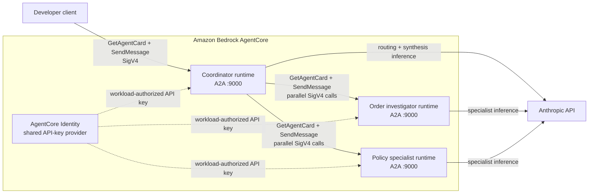

# Lab11 — Multi-runtime orchestration with A2A

Lab10 ran the coordinator and both specialists inside one AgentCore Runtime session. This lab deploys them as three independent AgentCore runtimes and uses the Agent2Agent (A2A) protocol for discovery and delegation.

One ARM64 image contains all three roles. Each runtime sets `AGENT_ROLE` to start the coordinator, order investigator, or policy specialist. The coordinator reads the specialists' Agent Cards, exposes their skills to Claude as tools, invokes the selected specialists concurrently, and synthesizes their evidence.

## What you will build



AgentCore runs each container in a separate runtime session microVM. Model inference is not performed inside those microVMs: each role calls the Anthropic API.

## A2A contract

Every role serves:

| Endpoint | Purpose |
| --- | --- |
| `GET /ping` | AgentCore health check returning `{ "status": "Healthy" }` |
| `GET /.well-known/agent-card.json` | Agent identity, skills, and JSON-RPC interface |
| `POST /` | A2A JSON-RPC messages |

AgentCore requires A2A containers to bind `0.0.0.0:9000`. The application uses the current A2A v1 SDK and enables its v0.3 compatibility adapter because AgentCore SDK invocations are headerless and AWS's documented wire request uses `message/send`.

## Prerequisites

- Node.js 22 or later and npm 10 or later
- Docker with Buildx and Docker Compose
- AWS CLI v2 configured with credentials
- Terraform 1.11 or later
- Access to AgentCore Runtime and Identity in `ap-southeast-1`
- An Anthropic API key with access to the selected Claude model

Your AWS principal must be able to manage ECR, IAM, AgentCore Runtime, AgentCore Identity credential providers, and the AgentCore service-linked role. It also needs `iam:PassRole` for the three execution roles.

## 1. Configure and install

Use the repository's root `.env` file:

```dotenv
ANTHROPIC_API_KEY=replace-with-your-anthropic-api-key
ANTHROPIC_BASE_URL=https://api.anthropic.com
CLAUDE_MODEL=claude-haiku-4-5-20251001
GATEWAY_API_KEY_VERSION=1
AWS_REGION=ap-southeast-1
AGENT_RUNTIME_USER_ID=lab11-demo-user
```

Then install this lab:

```bash
cd Lab11
npm ci
```

## 2. Run all three roles locally

Docker Compose builds the shared ARM64 image and starts three containers:

```bash
docker compose up --build
```

From another terminal, inspect their health and Agent Cards:

```bash
curl http://127.0.0.1:19000/ping
curl http://127.0.0.1:19001/.well-known/agent-card.json \
  -H 'A2A-Version: 1.0'
curl http://127.0.0.1:19002/.well-known/agent-card.json \
  -H 'A2A-Version: 1.0'
```

Invoke the coordinator:

```bash
npm run demo:local -- \
  "Investigate cases/case-001.md using both specialists."
```

The client first prints the coordinator skill it discovered. The coordinator then discovers the two specialist cards, lets Claude select the tools, runs both A2A calls concurrently, and prints the synthesized answer.

Stop the local stack with `docker compose down`.

## 3. Load deployment variables

Run these commands from `Lab11`:

```bash
set -a
source ../.env
set +a

export AWS_REGION="${AWS_REGION:-ap-southeast-1}"
export TF_VAR_aws_region="$AWS_REGION"
export TF_VAR_gateway_api_key="$ANTHROPIC_API_KEY"
export TF_VAR_gateway_api_key_version="${GATEWAY_API_KEY_VERSION:-1}"
export TF_VAR_anthropic_base_url="$ANTHROPIC_BASE_URL"
export TF_VAR_claude_model="$CLAUDE_MODEL"
export TF_VAR_agent_runtime_user_id="${AGENT_RUNTIME_USER_ID:-lab11-demo-user}"
```

`set -a` automatically exports variables loaded by `source`; `set +a` turns that behavior off afterward. The API key is passed through Terraform's ephemeral, write-only input and is not stored in state. Use version `1` for the initial credential. When changing the API key, increment `GATEWAY_API_KEY_VERSION` before loading these variables; Terraform detects the version change because it cannot compare a write-only key with its stored value.

## 4. Apply the bootstrap stage

The bootstrap stage creates one immutable ECR repository and one AgentCore Identity API-key credential provider:

```bash
terraform -chdir=infra/bootstrap init
terraform -chdir=infra/bootstrap apply
```

Review the plan before approving it. The local state is ignored by Git and is read by the runtime stage.

For example, when replacing the initially deployed key, set `GATEWAY_API_KEY_VERSION=2`, reload the deployment variables, and confirm the plan changes `api_key_wo_version` from `1` to `2`.

## 5. Build and push the shared image

```bash
npm run image:push -- v1
```

The script signs Docker in to ECR and builds one `linux/arm64` image. All three runtimes use the same immutable image tag with different `AGENT_ROLE` values.

## 6. Apply the runtime stage

```bash
export TF_VAR_image_tag=v1
terraform -chdir=infra/runtime init
terraform -chdir=infra/runtime apply
```

This creates three execution roles and three runtimes using `serverProtocol=A2A`. Every role can retrieve the shared Anthropic API credential. Only the coordinator role can discover and invoke the two specialist runtime ARNs.

The coordinator uses the static development user ID when invoking specialists so AgentCore supplies each specialist with a workload access token. Production systems should derive this identity from an authenticated principal or use JWT inbound authorization.

## 7. Require MMDSv2

Run the idempotent update after every Terraform runtime update until the AWS provider exposes the MMDSv2 setting:

```bash
npm run runtime:secure
```

The script checks and updates all three runtimes while preserving their A2A protocol, role, image, and environment. Wait until all runtime versions return to `READY` before invoking the coordinator.

## 8. Invoke the deployed coordinator

```bash
export AGENT_RUNTIME_ARN="$(terraform -chdir=infra/runtime output -raw coordinator_runtime_arn)"

npm run demo -- \
  "Investigate cases/case-001.md using both specialists."
```

The client uses the normal AWS credential chain. It retrieves the coordinator Agent Card, reuses that session for the A2A message, and prints the final text response.

The invoking principal needs these actions on the coordinator ARN:

```json
{
  "Effect": "Allow",
  "Action": [
    "bedrock-agentcore:GetAgentCard",
    "bedrock-agentcore:InvokeAgentRuntime",
    "bedrock-agentcore:InvokeAgentRuntimeForUser"
  ],
  "Resource": [
    "your-coordinator-runtime-arn",
    "your-coordinator-runtime-arn/runtime-endpoint/DEFAULT"
  ]
}
```

AgentCore authorizes qualified calls against the endpoint ARN. The coordinator execution role therefore receives the same three actions on each specialist runtime ARN and its `DEFAULT` endpoint ARN.

## What to observe

- Agent Cards provide the descriptions Claude uses to choose specialists.
- The order and policy runtimes are separate AgentCore resources and sessions.
- Selected specialist requests start together; cold starts and external model latency can still make the complete run slow.
- A failed specialist is returned to the synthesis step as failed evidence rather than hiding the other specialist's result.
- The application logs from each runtime appear under its own AgentCore CloudWatch log group.

## Verification

These checks are offline and do not modify AWS:

```bash
npm run typecheck
npm test
npm run build
docker buildx build --platform linux/arm64 --load -t agentic-ai-lab11:local .
```

## Updating the deployment

ECR tags are immutable. Build a new tag, update the runtimes, and re-run the MMDSv2 helper:

```bash
npm run image:push -- v2
export TF_VAR_image_tag=v2
terraform -chdir=infra/runtime apply
npm run runtime:secure
```

## Cleanup

Destroy the dependent runtime stage before the bootstrap stage:

```bash
terraform -chdir=infra/runtime destroy
terraform -chdir=infra/bootstrap destroy
```

The bootstrap repository uses `force_delete = true`, so destroying it also removes its images.

## References

- [Deploy A2A servers in AgentCore Runtime](https://docs.aws.amazon.com/bedrock-agentcore/latest/devguide/runtime-a2a.html)
- [AgentCore A2A protocol contract](https://docs.aws.amazon.com/bedrock-agentcore/latest/devguide/runtime-a2a-protocol-contract.html)
- [A2A JavaScript SDK](https://github.com/a2aproject/a2a-js)
