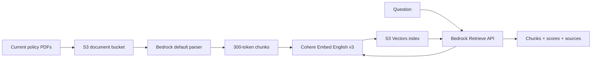

# Lab13 — Bedrock Knowledge Base retrieval

Lab13 starts the RAG learning path with retrieval before generation. It uploads five current policy PDFs to Amazon S3, lets Amazon Bedrock parse and chunk their selectable text, creates embeddings with Cohere Embed English v3, and stores those embeddings in S3 Vectors.

The retrieval command prints the raw chunks, similarity scores, metadata, and source locations. No LLM generates an answer in this lab, so you can inspect exactly what later RAG prompts will receive.

Lab13 does not use the Anthropic API key. AWS credentials cover ingestion, embedding, and retrieval.



## What you will learn

- The separate roles of the document bucket, embedding model, vector store, and knowledge base.
- How a knowledge base ingestion job parses, chunks, embeds, and indexes documents.
- How semantic retrieval differs from generated answers.
- Why the default PDF parser cannot retrieve facts that exist only inside images.

## Prerequisites

- Node.js 22 or later, npm 10 or later, AWS CLI v2, and Terraform 1.11 or later.
- AWS credentials configured for `ap-southeast-1` or the Region selected in Terraform.
- Permission to create the S3, S3 Vectors, IAM, and Bedrock Knowledge Base resources in `infra/`.
- Permission to invoke `cohere.embed-english-v3` in the selected Region.
- For the commands after deployment: `s3:PutObject`, `bedrock:StartIngestionJob`, `bedrock:GetIngestionJob`, and `bedrock:Retrieve` on the lab resources.

The AWS provider must be version 6.62 or later because Lab13 uses its S3 Vectors resources.

## Enable Cohere model access

Cohere Embed English v3 is a third-party model that requires a one-time AWS Marketplace activation for each AWS account. The **Open in playground** button is disabled for embedding models, so activate the model with the API instead.

Use an administrator or developer identity with `bedrock:InvokeModel`, `aws-marketplace:Subscribe`, `aws-marketplace:Unsubscribe`, and `aws-marketplace:ViewSubscriptions` permissions:

```bash
aws bedrock-runtime invoke-model \
  --region ap-southeast-1 \
  --model-id cohere.embed-english-v3 \
  --content-type application/json \
  --accept application/json \
  --cli-binary-format raw-in-base64-out \
  --body '{"texts":["Marketplace activation test"],"input_type":"search_document"}' \
  /tmp/cohere-embed-response.json
```

Wait about two minutes, then verify the model access:

```bash
aws bedrock get-foundation-model-availability \
  --region ap-southeast-1 \
  --model-id cohere.embed-english-v3
```

The response should report `AVAILABLE` for the agreement, entitlement, and Region, and `AUTHORIZED` for authorization. If access is already available, the activation invocation can be skipped.

The Marketplace permissions are only needed by the identity that performs this one-time activation. Do not add them to the Knowledge Base service role; that role only needs permission to invoke the embedding model after activation.

## Install

Use the shared `AWS_REGION` from the repository root `.env` file:

```bash
cd Lab13
npm ci
```

## Provision the knowledge base

Review the Terraform first, then run the following commands yourself:

```bash
terraform -chdir=infra init
terraform -chdir=infra plan
terraform -chdir=infra apply
```

The stack creates two different S3 resources:

- A regular S3 bucket containing the source PDFs.
- An S3 Vectors bucket and index containing their numerical embeddings.

Export the identifiers returned by Terraform:

```bash
export DOCUMENT_BUCKET="$(terraform -chdir=infra output -raw document_bucket)"
export BEDROCK_KNOWLEDGE_BASE_ID="$(terraform -chdir=infra output -raw knowledge_base_id)"
export BEDROCK_DATA_SOURCE_ID="$(terraform -chdir=infra output -raw data_source_id)"
```

## Upload and ingest the documents

Run one command to upload the fixed five-document corpus and wait for Bedrock ingestion to finish:

```bash
npm run ingest
```

The corpus includes the current Singapore and Australia refund policies, shipping investigation guide, warranty guide, and support escalation guide. It deliberately excludes the superseded policy and paired table fixtures, which are introduced in later labs.

The data source uses the default parser and fixed-size chunks of 300 tokens with 20% overlap. The default parser does not interpret image pixels.

## Inspect retrieval

Start with a fact contained in selectable PDF text:

```bash
npm run retrieve -- "What evidence is accepted for a damaged Singapore delivery?"
```

Relevant results should cite `sg-refund-policy-current.pdf` and include its evidence guidance.

Next, ask about facts that occur only inside the shipping timeline image:

```bash
npm run retrieve -- "When should domestic and international carrier investigations be opened?"
```

Bedrock may retrieve the page heading or caption, but the returned text will not contain the `+2` and `+5` business-day thresholds. This is the expected negative control: the embedding model cannot embed information the parser did not extract. Lab16 replaces this text-only parsing path with multimodal parsing.

## Verify and clean up

Offline checks do not require AWS credentials:

```bash
npm run typecheck
npm test
npm run build
```

When finished, destroy the resources yourself:

```bash
terraform -chdir=infra destroy
```

S3 storage, S3 Vectors storage and queries, Bedrock embeddings, and ingestion can incur charges. The source and vector buckets use `force_destroy` so the learning stack can be removed without manually emptying them.

## References

- [Amazon Bedrock Knowledge Bases](https://docs.aws.amazon.com/bedrock/latest/userguide/knowledge-base.html)
- [Parsing options for a data source](https://docs.aws.amazon.com/bedrock/latest/userguide/kb-advanced-parsing.html)
- [Retrieve API](https://docs.aws.amazon.com/bedrock/latest/APIReference/API_agent-runtime_Retrieve.html)
- [Using S3 Vectors with Bedrock Knowledge Bases](https://docs.aws.amazon.com/AmazonS3/latest/userguide/s3-vectors-bedrock-kb.html)
