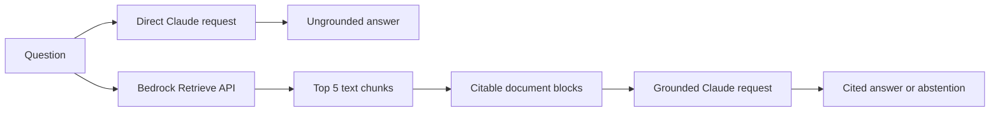

# Lab14 — Grounded answers and citations

Lab14 adds generation to the retrieval pipeline from Lab13. It asks Claude the same question twice: first without policy context, then with the five most relevant chunks from an Amazon Bedrock Knowledge Base.

The grounded request sends every retrieved chunk as a citation-enabled plain-text document. Claude must answer only from those documents, cite their PDF filenames, or abstain when the retrieved text does not contain the answer.



## What you will learn

- Why fluent model answers are not evidence of correctness.
- How to separate retrieval from generation in a manual RAG pipeline.
- How native Claude citations point back to retrieved source text.
- How an agent can abstain when retrieval does not contain a requested fact.

## Prerequisites

- Node.js 22 or later, npm 10 or later, AWS CLI v2, and Terraform 1.11 or later.
- AWS credentials configured for `ap-southeast-1` or the Region selected in Terraform.
- An Anthropic API key with API billing enabled.
- Permission to create the S3, S3 Vectors, IAM, and Bedrock Knowledge Base resources in `infra/`.
- Permission to invoke `cohere.embed-english-v3` in the selected Region.
- For ingestion and retrieval: `s3:PutObject`, `bedrock:StartIngestionJob`, `bedrock:GetIngestionJob`, and `bedrock:Retrieve` on the lab resources.

If Cohere Embed English v3 is not yet enabled for the AWS account and Region, follow the model-access steps in [Lab13](../Lab13/README.md#enable-cohere-model-access).

## Install

The lab reads the shared repository-root `.env` file:

```bash
cd Lab14
npm ci
```

The demo requires `ANTHROPIC_API_KEY`, `BEDROCK_KNOWLEDGE_BASE_ID`, and AWS credentials. `ANTHROPIC_BASE_URL`, `CLAUDE_MODEL`, and `AWS_REGION` use the shared defaults when omitted.

## Provision and ingest

Review the Terraform configuration, then provision it yourself:

```bash
terraform -chdir=infra init
terraform -chdir=infra plan
terraform -chdir=infra apply
```

Export the identifiers returned by Terraform:

```bash
export DOCUMENT_BUCKET="$(terraform -chdir=infra output -raw document_bucket)"
export BEDROCK_KNOWLEDGE_BASE_ID="$(terraform -chdir=infra output -raw knowledge_base_id)"
export BEDROCK_DATA_SOURCE_ID="$(terraform -chdir=infra output -raw data_source_id)"
```

Upload and ingest the same five current policy PDFs used by Lab13:

```bash
npm run ingest
```

The corpus excludes the superseded Singapore policy and both table fixtures. Those are introduced in later labs.

## Compare answers

Start with a fact contained in selectable PDF text:

```bash
npm run demo -- "What evidence is accepted for a damaged Singapore delivery?"
```

The command prints three sections:

- `[ungrounded]`: Claude's answer without retrieved policy evidence.
- `[retrieved]`: the source filenames, scores, and S3 locations returned by Bedrock.
- `[grounded]`: an answer containing native citations such as `[sg-refund-policy-current.pdf]`.

Next, ask about facts that appear only inside the shipping timeline image:

```bash
npm run demo -- "When should domestic and international carrier investigations be opened?"
```

The default Bedrock parser cannot extract the `+2` and `+5` business-day values from the image. The grounded answer should therefore be:

```text
I don't have enough evidence in the retrieved documents to answer that question.
```

This negative control demonstrates that generation cannot recover evidence that retrieval never received. Lab16 replaces the parser with a multimodal path.

## Verify and clean up

Offline checks do not require AWS or Anthropic credentials:

```bash
npm run typecheck
npm test
npm run build
```

When finished, destroy the resources yourself:

```bash
terraform -chdir=infra destroy
```

S3 storage, S3 Vectors queries, Bedrock embeddings, and Anthropic API requests can incur charges.

## References

- [Amazon Bedrock Retrieve API](https://docs.aws.amazon.com/bedrock/latest/APIReference/API_agent-runtime_Retrieve.html)
- [Retrieving from Bedrock Knowledge Bases](https://docs.aws.amazon.com/bedrock/latest/userguide/kb-how-retrieval.html)
- [Claude citations](https://platform.claude.com/docs/en/build-with-claude/citations)
- [Claude Messages API](https://platform.claude.com/docs/en/api/messages)
