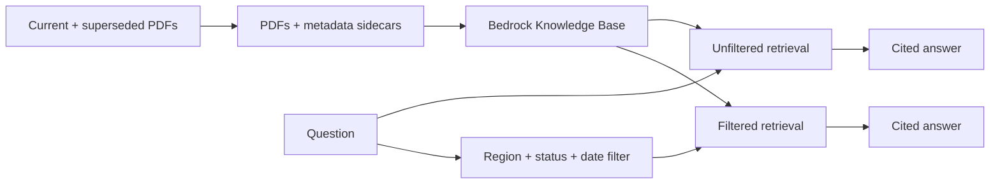

# Lab15 — Version-aware retrieval

Lab15 adds document metadata and retrieval filters to the cited RAG pipeline from Lab14. Its corpus includes both the current and superseded Singapore refund policies so you can see obsolete sources appear in an unfiltered semantic search and disappear when the same question is filtered.

Each demo runs two retrieval-and-generation paths with the same question. The first is unfiltered. The second requires the selected regional or global documents, the selected status, and an effective date no later than the supplied cutoff.



## What you will learn

- How S3 metadata sidecars attach filterable attributes to every document chunk.
- Why semantic similarity alone can retrieve an obsolete policy.
- How to compose Bedrock `andAll`, `orAll`, `equals`, and `lessThanOrEquals` filters.
- How to test retrieval constraints without relying on nondeterministic generated wording.

## Prerequisites

- Node.js 22 or later, npm 10 or later, AWS CLI v2, and Terraform 1.11 or later.
- AWS credentials configured for `ap-southeast-1` or the Region selected in Terraform.
- An Anthropic API key with API billing enabled for the interactive demo.
- Permission to create the S3, S3 Vectors, IAM, and Bedrock Knowledge Base resources in `infra/`.
- Permission to invoke `cohere.embed-english-v3` in the selected Region.

If Cohere Embed English v3 is not yet enabled, follow the model-access steps in [Lab13](../Lab13/README.md#enable-cohere-model-access).

## Install

```bash
cd Lab15
npm ci
```

The lab reads the shared repository-root `.env`. Retrieval requires `BEDROCK_KNOWLEDGE_BASE_ID` and AWS credentials. The demo also requires `ANTHROPIC_API_KEY`.

## Provision and ingest

Review and provision the self-contained stack yourself:

```bash
terraform -chdir=infra init
terraform -chdir=infra plan
terraform -chdir=infra apply
```

Export the identifiers returned by Terraform:

```bash
export DOCUMENT_BUCKET="$(terraform -chdir=infra output -raw document_bucket)"
export BEDROCK_KNOWLEDGE_BASE_ID="$(terraform -chdir=infra output -raw knowledge_base_id)"
export BEDROCK_DATA_SOURCE_ID="$(terraform -chdir=infra output -raw data_source_id)"
```

Upload and ingest six PDFs and their metadata sidecars:

```bash
npm run ingest
```

Every `<document>.pdf.metadata.json` contains `document_id`, `title`, `region`, `version`, `status`, and numeric `effective_date` attributes. They are filterable but excluded from embeddings, so the comparison isolates the effect of filtering.

## Compare retrieval paths

All three filter options are required:

```bash
npm run demo -- \
  --region Singapore \
  --status current \
  --as-of 2026-09-14 \
  "What evidence is accepted for a damaged Singapore delivery?"
```

The output includes:

- `[filter]`: the exact filter criteria.
- `[unfiltered retrieved]` and `[unfiltered answer]`: results that may include the superseded PDF.
- `[filtered retrieved]` and `[filtered answer]`: only matching current, effective Singapore or global documents.

For Singapore and Australia, the region constraint deliberately includes documents tagged `Global`. A `Global` filter matches only global documents.

## Run retrieval regressions

Run the four live retrieval cases without making Anthropic API requests:

```bash
npm run evaluate
```

The cases verify that:

- An unfiltered Singapore query can surface both current and archived policies.
- The current Singapore filter excludes the superseded PDF.
- Australia filters exclude Singapore policies.
- Regional filters retain globally applicable guidance.
- The effective-date cutoff excludes a future-effective document.

The command prints a table and exits unsuccessfully if any expected source or metadata constraint fails.

## Verify and clean up

Offline checks require no AWS or Anthropic credentials:

```bash
npm run typecheck
npm test
npm run build
```

When finished, destroy the resources yourself:

```bash
terraform -chdir=infra destroy
```

S3 storage, S3 Vectors queries, Bedrock embeddings, and Anthropic API requests can incur charges.

## References

- [Connect an S3 data source and add document metadata](https://docs.aws.amazon.com/bedrock/latest/userguide/s3-data-source-connector.html)
- [Configure Knowledge Base metadata filters](https://docs.aws.amazon.com/bedrock/latest/userguide/kb-test-config.html)
- [Amazon Bedrock Retrieve API](https://docs.aws.amazon.com/bedrock/latest/APIReference/API_agent-runtime_Retrieve.html)
- [Claude citations](https://platform.claude.com/docs/en/build-with-claude/citations)
