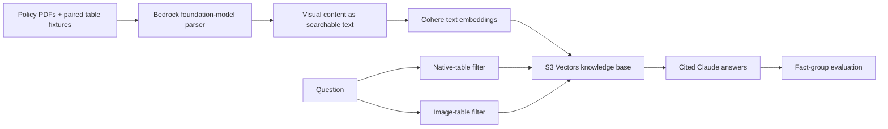

# Lab16 — Multimodal PDF RAG

Lab16 adds visual parsing to the version-aware RAG pipeline from Lab15. A Bedrock vision model extracts searchable text from diagrams and image-only tables before Cohere embeds it. Claude still receives only retrieved text, cites its source PDFs, and abstains when the evidence is insufficient.

The corpus includes two return-processing PDFs with the same six-row table. One uses native selectable text; the other embeds the table as an image. Exact document filters let the comparison ask both representations the same question without mixing their evidence.



## What you will learn

- Why the default PDF parser misses facts that exist only in diagrams or images.
- How a foundation-model parser converts visual structure into retrievable text.
- How metadata filters isolate equivalent document representations.
- How to score grounded answers with required facts, citations, and abstention checks.

## Prerequisites

- Node.js 22 or later, npm 10 or later, AWS CLI v2, and Terraform 1.11 or later.
- AWS credentials configured for `ap-southeast-1` in `infra/terraform.tfvars` and `AWS_REGION`.
- An Anthropic API key with API billing enabled for comparison and answer evaluation.
- Permission to create the S3, S3 Vectors, IAM, and Bedrock Knowledge Base resources in `infra/`.
- Access to Cohere Embed English v3 and the Amazon Nova Lite APAC inference profile.

Lab16 derives the Nova Lite profile and IAM resource ARNs automatically. The Knowledge Base, S3 buckets, embeddings, and vector index remain in Singapore. Visual parsing uses the geographic `apac.amazon.nova-lite-v1:0` profile and may process document content in another APAC Region. Geographic profiles do not route outside their defined geography.

## Install

```bash
cd Lab16
npm ci
```

The lab reads the shared repository-root `.env`. Retrieval requires `BEDROCK_KNOWLEDGE_BASE_ID` and AWS credentials. Commands that generate answers also require `ANTHROPIC_API_KEY`.

## Provision

Copy the example variables:

```bash
cp infra/terraform.tfvars.example infra/terraform.tfvars
```

Review and provision the self-contained stack yourself:

```bash
terraform -chdir=infra init
terraform -chdir=infra plan
terraform -chdir=infra apply
```

Run `terraform init` again after pulling infrastructure changes so Terraform can install the HashiCorp time provider. Knowledge Base creation waits 30 seconds after IAM policy changes to allow AWS permissions to propagate.

Export the identifiers returned by Terraform:

```bash
export DOCUMENT_BUCKET="$(terraform -chdir=infra output -raw document_bucket)"
export MULTIMODAL_BUCKET="$(terraform -chdir=infra output -raw multimodal_bucket)"
export BEDROCK_KNOWLEDGE_BASE_ID="$(terraform -chdir=infra output -raw knowledge_base_id)"
export BEDROCK_DATA_SOURCE_ID="$(terraform -chdir=infra output -raw data_source_id)"
```

Keep `AWS_REGION` aligned with `aws_region`, then upload and ingest all eight PDFs:

```bash
npm run ingest
```

Foundation-model parsing applies to every PDF and incurs model usage charges. Source PDFs and extracted multimodal content use separate S3 buckets because Bedrock requires the supplemental storage URI to identify a bucket root. Bedrock manages generated objects in the multimodal bucket, typically under an `aws/` prefix. Only `documents/` in the source bucket is ingested.

If your AWS Organization restricts Regions with service control policies, every Nova Lite APAC profile destination must be permitted or ingestion will fail. Terraform grants the Knowledge Base role permission to inspect and invoke the APAC profile and invoke only the Nova Lite foundation model across its candidate Regions.

## Query visual policy facts

The Lab15 version filters remain available. This question targets values present only in the shipping timeline image:

```bash
npm run demo -- \
  --region Global \
  --status current \
  --as-of 2026-09-14 \
  "When should domestic and international carrier investigations be opened?"
```

The filtered answer should identify `+2 business days` for domestic shipments and `+5 business days` for international shipments, citing `shipping-investigation-guide.pdf`.

## Compare native and image tables

```bash
npm run compare -- "Compare electronics rules for Singapore and Australia."
```

The command runs two isolated RAG paths and prints `[native retrieved]`, `[native answer]`, `[image retrieved]`, and `[image answer]`. Evidence previews expose the parser output; each answer must cite its matching table PDF.

## Evaluate grounded-answer parity

Run the four documented table questions against both representations:

```bash
npm run evaluate
```

The evaluator makes eight Claude requests. Each result passes only if it does not abstain, cites the expected PDF, and contains every required fact group. Accepted alternatives such as `10%` and `10 percent` are normalized and scored deterministically. Any failed path gives the process a non-zero exit code.

Retain Lab15's live source and metadata checks with:

```bash
npm run evaluate:retrieval
```

Bedrock can fall back to its default parser if visual parsing fails. The paired answer evaluation makes that failure visible when the image table's facts are absent.

## Verify and clean up

Offline checks require no AWS or Anthropic credentials:

```bash
npm run typecheck
npm test
npm run build
```

When finished, destroy the resources yourself:

```bash
terraform -chdir=infra destroy
```

S3 storage, S3 Vectors queries, Bedrock embeddings and parsing, and Anthropic API requests can incur charges. The documents are synthetic and must not be used as real support policy.

## References

- [Parsing options for a Bedrock Knowledge Base data source](https://docs.aws.amazon.com/bedrock/latest/userguide/kb-advanced-parsing.html)
- [Nova Lite regional availability](https://docs.aws.amazon.com/bedrock/latest/userguide/models-region-compatibility.html)
- [Geographic cross-Region inference](https://docs.aws.amazon.com/bedrock/latest/userguide/geographic-cross-region-inference.html)
- [Create a multimodal Knowledge Base](https://docs.aws.amazon.com/bedrock/latest/userguide/kb-multimodal-create.html)
- [Permissions for multimodal content](https://docs.aws.amazon.com/bedrock/latest/userguide/kb-permissions.html)
- [Amazon Bedrock Retrieve API](https://docs.aws.amazon.com/bedrock/latest/APIReference/API_agent-runtime_Retrieve.html)
- [Claude citations](https://platform.claude.com/docs/en/build-with-claude/citations)
